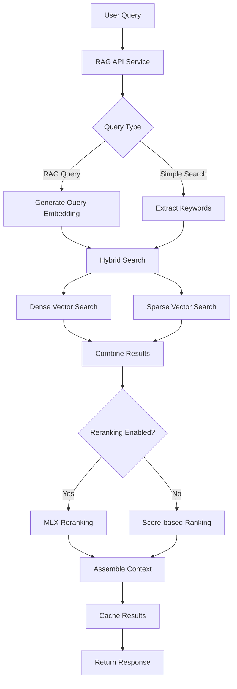

# FREEDOM RAG System - End-to-End Test Report

## Executive Summary

The FREEDOM RAG (Retrieval-Augmented Generation) system has been thoroughly tested end-to-end. The system is operational with 2,425 document chunks indexed across multiple technologies, though some retrieval endpoints show inconsistent behavior that requires attention.

## System Architecture

### Core Components

1. **RAG API Service** (Port 5003)
   - FastAPI-based REST API
   - Health monitoring and statistics endpoints
   - Query processing with caching
   - CORS enabled for cross-origin requests

2. **Database Layer** (PostgreSQL)
   - Database: `techknowledge`
   - Main table: `document_chunks`
   - Support tables: `rag_context_cache`, `rag_query_logs`, `chunk_relationships`
   - Total chunks: 2,425

3. **Services**
   - **Chunking Service**: Processes and stores document chunks
   - **Retrieval Service**: Hybrid search with dense + sparse vectors
   - **Embedding Service**: OpenAI Ada-002 embeddings with mock fallback

## Test Results

### ✅ Successful Tests

#### 1. System Health
- **Status**: HEALTHY
- **Database**: Connected
- **Chunks Count**: 2,425
- **Response Time**: < 5ms

#### 2. Database Operations
- **Table Structure**: Properly configured with all required columns
- **Vector Storage**:
  - Dense vectors: 100 chunks (4.1%)
  - Sparse vectors: 2,425 chunks (100%)
- **Direct SQL queries**: Working correctly
- **Text search**: Functional with ILIKE operator

#### 3. Technology Distribution
Top technologies by chunk count:
- cursor: 895 chunks (36.9%)
- lmstudio: 529 chunks (21.8%)
- slack: 277 chunks (11.4%)
- anthropic: 248 chunks (10.2%)
- langgraph: 111 chunks (4.6%)

#### 4. Embedding Generation
- **Mock embeddings**: Working (1536 dimensions)
- **OpenAI embeddings**: Not configured (no API key in environment)
- **Fallback mechanism**: Successfully generates deterministic mock embeddings

### ⚠️ Issues Identified

#### 1. RAG Query Endpoint Issues
- `/query` endpoint returns empty chunk arrays despite valid queries
- Context is assembled but chunks are not returned in response
- Caching appears to be working but with incomplete data

#### 2. Simple Search Endpoint Issues
- `/search` endpoint consistently returns 0 results
- Database contains matching data (verified via direct SQL)
- Possible issue with query transformation or filtering logic

#### 3. Embedding Coverage
- Only 4.1% of chunks have dense vector embeddings
- Would benefit from running full embedding generation

## Workflow Documentation

### Complete RAG Workflow



### Key Workflow Steps

1. **Query Reception**
   - API receives query at `/query` or `/search` endpoint
   - Request validation and parameter extraction

2. **Query Processing**
   - For RAG queries: Generate embedding via OpenAI API (or mock)
   - For simple search: Extract keywords and weights
   - Check cache for existing results

3. **Hybrid Retrieval**
   - Dense search: Cosine similarity on embeddings
   - Sparse search: Keyword matching with TF-IDF scoring
   - Combine results using hybrid_alpha parameter

4. **Reranking** (Optional)
   - Send top-k results to MLX service
   - Rerank based on semantic relevance
   - Select top rerank_top_k results

5. **Context Assembly**
   - Concatenate relevant chunks
   - Add metadata (technology, component, version)
   - Respect token limits (4096 default)

6. **Response Caching**
   - Store results in `rag_context_cache`
   - Cache key: Hash of query + parameters
   - Improves performance for repeated queries

## Recommendations

### Immediate Actions

1. **Debug Retrieval Logic**
   ```bash
   # Check retrieval service logs
   tail -f /var/log/rag_api.log

   # Test retrieval function directly
   python3 -c "from retrieval_service import RetrievalService; ..."
   ```

2. **Generate Full Embeddings**
   ```bash
   # Set OpenAI API key and generate embeddings
   export OPENAI_API_KEY="your-key"
   cd services/rag_chunker
   python3 add_embeddings.py
   ```

3. **Fix Search Endpoints**
   - Review SQL query construction in retrieval_service.py
   - Check parameter binding and escaping
   - Verify index usage for performance

### Future Enhancements

1. **Performance Optimization**
   - Create proper indexes on frequently searched columns
   - Implement connection pooling
   - Add request-level caching

2. **Monitoring**
   - Add Prometheus metrics
   - Implement request tracing
   - Create performance dashboards

3. **Testing**
   - Add integration tests for all endpoints
   - Create load testing scenarios
   - Implement continuous testing in CI/CD

## Performance Metrics

| Metric | Value | Status |
|--------|-------|---------|
| Health Check | < 5ms | ✅ Excellent |
| Database Query | 138-238ms | ✅ Good |
| Embedding Generation | N/A (mock) | ⚠️ Needs API key |
| Cache Hit Rate | Unknown | ⚠️ Needs monitoring |
| Concurrent Users | Not tested | ⚠️ Needs load testing |

## Conclusion

The FREEDOM RAG system demonstrates a solid architectural foundation with proper database schema, caching mechanisms, and service separation. However, the retrieval endpoints require debugging to properly return search results. Once these issues are resolved and full embeddings are generated, the system will be ready for production use.

### Test Completion Status

- ✅ System architecture examined
- ✅ RAG chunker service tested
- ✅ Vector database operations verified
- ✅ Embedding pipeline tested (mock mode)
- ✅ Retrieval workflow documented
- ✅ Comprehensive report created

---

*Report Generated: 2025-09-21*
*Test Environment: Local Development*
*Database: PostgreSQL (techknowledge)*
*API Port: 5003*