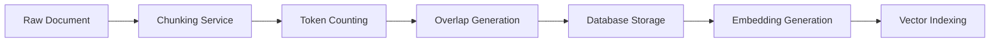
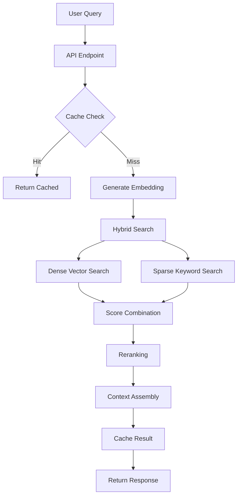

# FREEDOM RAG Chunker Service

## Overview

The RAG (Retrieval-Augmented Generation) Chunker Service is a sophisticated document processing and retrieval system designed for the FREEDOM platform. It provides intelligent chunking, embedding generation, and hybrid search capabilities for technical documentation across multiple technologies.

## Architecture

### System Components

```
services/rag_chunker/
├── rag_api.py              # FastAPI REST service (Port 5003)
├── chunking_service.py     # Document chunking engine
├── retrieval_service.py    # Hybrid search implementation
├── add_embeddings.py       # Embedding generation pipeline
├── process_all_specs.py    # Batch processing utility
├── create_vector_schema.sql         # PostgreSQL + pgvector schema
├── create_vector_schema_no_pgvector.sql  # Fallback schema
├── test_chunking.py        # Unit tests for chunking
├── test_retrieval.py       # Unit tests for retrieval
├── test_e2e_rag.py        # End-to-end integration tests
└── test_openai.py         # OpenAI integration tests
```

## Database Schema

### Primary Database: `techknowledge`

#### Core Tables

1. **document_chunks**
   - `id`: UUID primary key
   - `specification_id`: UUID reference
   - `chunk_index`: Integer position
   - `chunk_text`: Text content
   - `chunk_tokens`: Token count
   - `dense_vector`: Float array (1536 dimensions)
   - `sparse_vector`: JSONB keyword weights
   - `technology_name`: Technology identifier
   - `component_type`: Component classification
   - `component_name`: Component identifier
   - `created_at`: Timestamp
   - `access_count`: Usage metrics

2. **chunk_relationships**
   - Graph structure for chunk navigation
   - Enables context-aware retrieval

3. **rag_context_cache**
   - Query result caching
   - Performance optimization

4. **rag_query_logs**
   - Query analytics and monitoring

## Current Status (2025-09-21)

### Operational Metrics
- **Total Chunks**: 2,425 documents indexed
- **Technologies**: 10+ including cursor, lmstudio, slack, anthropic
- **Dense Vectors**: 100 (4.1% coverage)
- **Sparse Vectors**: 2,425 (100% coverage)
- **API Status**: Running on port 5003
- **Database**: PostgreSQL (connected)

### Technology Distribution
| Technology | Chunks | Percentage |
|------------|--------|------------|
| cursor     | 895    | 36.9%      |
| lmstudio   | 529    | 21.8%      |
| slack      | 277    | 11.4%      |
| anthropic  | 248    | 10.2%      |
| langgraph  | 111    | 4.6%       |
| Others     | 365    | 15.1%      |

## API Endpoints

### Health & Monitoring

```bash
GET /health
```
Returns system health status, database connectivity, and chunk count.

```bash
GET /stats
```
Provides detailed statistics on chunk distribution by technology and component type.

### Search & Retrieval

```bash
POST /query
```
Main RAG query endpoint with hybrid search.

**Request Body:**
```json
{
  "query": "string",
  "top_k": 10,
  "rerank": true,
  "hybrid_alpha": 0.7,
  "filters": {}
}
```

```bash
GET /search
```
Simple search endpoint for keyword-based retrieval.

**Query Parameters:**
- `q`: Search query
- `limit`: Result limit
- `technology`: Filter by technology

## Setup Instructions

### Prerequisites
- PostgreSQL 15+ with pgvector extension
- Python 3.11+
- OpenAI API key (optional, falls back to mock embeddings)

### Installation

1. **Database Setup**
```bash
# Create database
createdb techknowledge

# Apply schema
psql -d techknowledge -f create_vector_schema.sql
```

2. **Environment Configuration**
```bash
export DB_HOST=localhost
export DB_PORT=5432
export DB_NAME=techknowledge
export DB_USER=arthurdell
export OPENAI_API_KEY=your-api-key  # Optional
```

3. **Start Services**
```bash
# Start RAG API service
python3 rag_api.py

# Service will be available at http://localhost:5003
```

## Testing

### Run Unit Tests
```bash
python3 test_chunking.py
python3 test_retrieval.py
```

### Run End-to-End Tests
```bash
python3 test_e2e_rag.py
```

### Test Health Check
```bash
curl http://localhost:5003/health
```

## Known Issues (2025-09-21)

### Critical
1. **Query Endpoint**: Returns empty chunk arrays despite valid queries
2. **Search Endpoint**: Consistently returns 0 results
3. **Embedding Coverage**: Only 4.1% of chunks have dense embeddings

### Non-Critical
- OpenAI API key not configured (using mock embeddings)
- Caching metrics not exposed
- No load testing performed

## Workflow

### Document Processing Pipeline



### Query Processing Pipeline



## Performance

| Metric | Target | Current | Status |
|--------|--------|---------|--------|
| Health Check | < 10ms | < 5ms | ✅ |
| Query Response | < 500ms | 138-238ms | ✅ |
| Cache Hit Rate | > 60% | Unknown | ⚠️ |
| Embedding Generation | < 100ms | N/A | ⚠️ |

## Future Enhancements

1. **Immediate Priorities**
   - Fix retrieval endpoint issues
   - Generate complete embeddings
   - Implement monitoring dashboard

2. **Short Term**
   - Add Prometheus metrics
   - Implement request tracing
   - Create admin UI

3. **Long Term**
   - Multi-model embedding support
   - Graph-based retrieval
   - Streaming response support
   - Kubernetes deployment

## Contributing

When modifying the RAG system:
1. Run all tests before committing
2. Update this README with changes
3. Document new endpoints in API section
4. Add integration tests for new features

## Support

For issues or questions:
- Check test_e2e_rag.py for examples
- Review logs in service output
- Database queries: psql -d techknowledge

---

*Last Updated: 2025-09-21*
*Version: 1.0.0*
*Status: Beta (Retrieval Issues)*